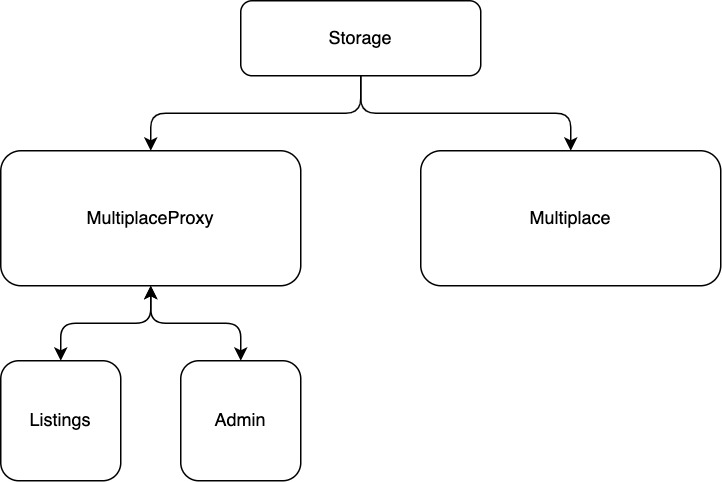

# Multiplace

The intefaceID for the multiplace is `0x52ed7671`, i.e. `type(IMultiplace).interfaceId=0x52ed7671`.

## Introduction

A marketplace contract that can facilitate the listing and buying of ERC721 and ERC1155 tokens. The marketplace supports ERC2981 and calculates the royalties due to the receiver when an item is listed. If an ERC721 or ERC1155 does not support ERC2981, a low-level call is made to see if the NFT has an `owner` attribute, if so, this address is set to the receiver and this address can update the royalty amount after listing an NFT.

Upon listing, the seller would have needed to approve the marketplace to spend the NFT. If the seller revokes the approval or transfers the NFT, the `unlistStale` method can be called to remove a listing from the listings array.

Any ERC20 token can be used to list an item (provided that it has been added to the list of supported payment tokens). Upon purchasing, the buyer's balance is checked to ensure they have enough ERC20 tokens to make the purchase, as well as making sure that the seller still owns the NFT and that the marketplace still has the approval to transfer the NFT.

The marketplace follows a pull funds method with regards to the ERC20 tokens transferred to the seller, artist and protocol's wallets. The `pullFunds` method can be used to extract available funds for a given ERC20 token. A protocol fee is charged for each purchase and a percentage of the ERC20 token (set using `protocolFeeNumerator` and `protocolFeeDenominator`) is transferred to the protocol wallet's balance in the marketplace.

## Improvements from previous marketplace

This repo builds on the marketplace built <a href='https://github.com/fan-fire/marketplace'>here</a> and uses the name Multiplace instead of Marketplace to make a distinction between the two architectures. The main shortcoming of <a href='https://github.com/fan-fire/marketplace'>the previous</a> marketplace was that it could not facilitait multiple 1155 token purchases - this repo address that issue by letting the primary key of a listing be the tuple: `seller, tokenAddr, tokenId` instead of just `tokenAddr, tokenId` as with the previous marketplace. This allows the marketplace to have multiple listings for a tokenAddr, but only _one_ listing per tokenId (within a tokenAddr) for a seller.

Adding the additional nesting level (`seller`) per listings as well as the addition of a few other helper methods had the consequence that the compiled bytecode for the Multiplace contract exceeded the `24.576 kb` <a href='https://eips.ethereum.org/EIPS/eip-170'>size limit</a> intdroduced in the <a href='https://eips.ethereum.org/EIPS/eip-607'>Spurious Dragon</a> hard-fork. This led to a redesign in the architecture of the multiplae moving all the listings into the `Listings` contact and moving all "admin" related logic to the `Admin` contract. At the time of writing the contract sizes are as follows:

```bash
 ·-------------------|-------------|
 |  Contract Name    ·  Size (KB)  ·
 ····················|·············|
 |  Admin            ·      2.854  ·
 ····················|·············|
 |  Listings         ·     22.169  ·
 ····················|·············|
 |  Multiplace       ·     24.091  ·
 ····················|·············|
 |  MultiplaceProxy  ·      4.792  ·
 ·-------------------|-------------|
```

At a high level the architecture looks as follows:

<div align='center'>
    
</div>

## Getting Started

Install all the required packages

```bash
npm install
```

Make sure you have nodejs installed and can use `hardhat` - see <a href='https://hardhat.org/tutorial/setting-up-the-environment'>here</a> for more.

Run the unit tests to make sure everything is working as it should.

```bash
npx hardhat test
```

The marketplace uses OpenZeplin's `TransparentUpgradeableProxy` proxy - to deploy both the proxy and marketplace using `hardhat` you can run

```javascript
// deploy the marketplace
const Multiplace = await ethers.getContractFactory("Multiplace");
multiplace = await Multiplace.deploy();
await multiplace.deployed();

// deploy the proxy, with the afore mentioned marketplace as the default marketplace
const MultiplaceProxy = await ethers.getContractFactory("MultiplaceProxy");
multiplaceProxy = await MultiplaceProxy.deploy(multiplace.address);
await multiplaceProxy.deployed();

// interact with the marketplace via the proxy using .at
multiplace = Multiplace.attach(multiplaceProxy.address);
```

The storage looks as follows and is shared by the Proxy and Marketplace contracts to ensure upgradability:

```sol
abstract contract Storage is AccessControl {
  address public currentMultiplace;
  IAdmin public admin;
  IListings public listings;

  address internal owner;
  mapping(address => bool) internal _isPaymentToken; //Whether a given ERC20 contract is an excepted payment token
  bytes32 internal constant RESERVER_ROLE = keccak256("RESERVER_ROLE");
  mapping(address => mapping(address => uint256)) internal _balances; //Balances of each address for each ERC20 contract, 0x00 is the native coin

  function supportsInterface(bytes4 interfaceId)
    public
    view
    override(AccessControl)
    returns (bool)
  {
    return
      interfaceId == type(IMultiplace).interfaceId ||
      interfaceId == type(IAccessControl).interfaceId ||
      interfaceId == type(IERC165).interfaceId;
  }
}

```

To ensure that both the `Multiplace`'s and `MultiplaceProxy`'s `supportsInterface` gets overriden, we've opted to define `supportsInterface` in the `Storage` contract as both `Multiplace` and `MultiplaceProxy` will inherit from here.

## Structure

The marketplace keeps an array of listings with structure:

```sol
struct Listing {
  uint256 listPtr; //Pointer to where this listing is located in the listings array
  address tokenAddr; //Address of the ERC721 or ERC1155 contract of the listed item
  uint256 tokenId; //token ID of the listed item for tokenAddr
  address seller; //Address of the seller
  uint256 unitPrice; //unitPrice of the listed item
  uint256 amount; //number of tokens in listing
  address paymentToken; //Address of the ERC20 contract that will be used to pay for the listing
  NFT_TYPE nftType; //Type of the listed item. Either ERC721 or ERC1155 with or without ERC2981
  uint256 reservedUntil; //Timestamp when the listing will be reserved
  address reservedFor; //Address of the buyer who reserved the listing
}

```

and only supports 4 types of NFTs, all of which need to implement `ERC165` to be listed, otherwise an `UNKOWN` type is assigned and the token can't be listed.

```sol
enum NFTType {
  ERC721,
  ERC721_2981,
  ERC1155,
  ERC1155_2981,
  UNKOWN
}

```

The other structure used is `Royalty` defined as:

```sol
struct Royalty {
  address receiver;
  uint256 unitRoyaltyAmount;
}

```

## Methods

### General Usage

The 4 main methods are `list`, `buy`, `unlist` and `unlistStale`.

`list` assumes that the owner of the NFT is listing the token and that `setApprovalForAll()` has been called by the token holder on the NFT contract to approve the marketplace address to spend the tokens in the NFT contract. The `unitPrice` is denominated in Wei in the ERC20 defined by `paymentToken`. For `ERC721` contracts the `amount` argument is ignored and set to `1` during listing. However, for `ERC1155` contracts amount will specify how many of `tokenId` are contained in the listing.

`buy` assumes that the buyer has at least `unitPrice x amount`, and has approved the marketplace with at least `unitPrice x amount` of the ERC20 token before calling the `buy` method. A buyer can buy a partial `amount` of a listing in the case of `ERC1155` listings and the listing will only be removed once the full amount has been depleted.

`unlist` can only be called by the lister/seller of an NFT. However, if a listing has gone stale (either the original seller has transferred the token after listing, or has revoked their approval) the listing can be unlisted using the `unlistStale` method by anyone.

```sol
list(
    address tokenAddr,
    uint256 tokenId,
    uint256 amount,
    uint256 unitPrice,
    address paymentToken
)
```

```sol
buy(
    address seller,
    address tokenAddr,
    uint256 tokenId,
    uint256 amount
)
```

```sol
unlist(
    address nftAddress,
    uint256 tokenId
)
```

```sol
unlistStale(
    address seller,
    address tokenAddr,
    uint256 tokenId
)
```

### Querying

Listings can be viewed using either the `getListing`, `getListings`, `getAddressListings`,`getAllListings`, `getListingPointer` or `getListingByPointer`, method - depending on what you'd like to do. The pointer returned and used by the `getListingPointer` and `getListingByPointer` methods is the place in the `_listings` array where the token is located.

```sol
function getListing(
  address seller,
  address tokenAddr,
  uint256 tokenId
) view returns (IListings.Listing memory listing);

```

```sol
function getListings(address tokenAddr, uint256 tokenId)
  view
  returns (IListings.Listing[] memory listings);

```

```sol
function getAddressListings(address[] memory tokenAddrs)
  view
  returns (IListings.Listing[] memory _listings);

```

```sol
function getAllListings() view returns (IListings.Listing[] memory listings);

```

```sol
function getListingPointer(
  address seller,
  address tokenAddr,
  uint256 tokenId
) view returns (uint256 listPtr);

```

```sol
function getListingByPointer(uint256 listPtr)
  view
  returns (IListings.Listing memory listing);

```

To get all the sellers of a specific token you can call `getSellers`.

```sol
function getSellers(address tokenAddr, uint256 tokenId)
  view
  returns (address[] memory sellers);

```

The `status` method can be used to verify that a token is still purchasable.

```sol
function status(
  address seller,
  address tokenAddr,
  uint256 tokenId
)
  view
  returns (
    bool isSellerOwner,
    bool isTokenStillApproved,
    IListings.Listing memory listing
  );

```

`isListed` check if a given nft-tokenId is listed on the marketplace.

```sol
function isListed(
  address seller,
  address tokenAddr,
  uint256 tokenId
) view returns (bool listed);

```

`isPaymentToken` check whether a given ERC20 token can be used as a payment token.

```sol
function isPaymentToken(address paymentToken) view returns (bool);

```

`getBalance` is used to check the balance of a given wallet-ERC20 token pair in the marketplace which can be pulled using `pullFunds`

```sol
function getBalance(address paymentToken, address account)
  returns (uint256 balance);

```

`getUnitRoyalties` is used to check the total amount of royalties that will be paid to the artist when the purchase goes through.

```sol
function getUnitRoyalties(
  address seller,
  address tokenAddr,
  uint256 tokenId
) view returns (IListings.Royalty memory royalty);

```

### Admin methods

ERC20 payment tokens can be added by the `DEFAULT_ADMIN_ROLE` using the `addPaymentToken` method:

```sol
function addPaymentToken(address paymentToken);

```

We saw a need to build a way for wallets with the `RESERVER_ROLE` privileges to be able to reserve a token for a specific wallet. This is required when dealing with FIAT purchases and the token needs to be put on hold until the FIAT payment clears to crypto and the purchase can be made.

```sol
function reserve(
    address seller,
    address tokenAddr,
    uint256 tokenId,
    uint256 period,
    address reservee
    )
public
onlyRole(RESERVER_ROLE)
```

If the protocol wallet address needs to change, this can be done by the owner who has the `DEFAULT_ADMIN_ROLE` using the `changeProtocolWallet` method.

```sol
function changeProtocolWallet(address newProtocolWallet);

```

Similarly, if the protocol fee needs to change, this can be done by the owner who has the `DEFAULT_ADMIN_ROLE` using the `changeProtocolFee` method.

```sol
function changeProtocolFee(uint256 feeNumerator, uint256 feeDenominator);

```

The marketplace supports pausing and unpausing by the owner who has the `DEFAULT_ADMIN_ROLE` using the `pause` and `unpause` methods.

```sol
function pause() public onlyRole(DEFAULT_ADMIN_ROLE);

```

```sol
function unpause() public onlyRole(DEFAULT_ADMIN_ROLE);

```

### Artist methods

Artists can update their royalty amounts using the `updateRoyalties` method. In the case that an ERC721 or ERC1155 supports ERC2981, then the ERC2981 royaltyInfo method is called when calling `updateRoyalties` and the amount is updated based on the listing price - in other words, the `amount` argument is ignored if an NFT supports ERC2981. The amount can however be set if the ERC721 or ERC1155 has an owner, then this owner is the only person who can update the amount - the royalty receiver can not be updated and the artist funds will always be allocated to the original owner's address. By default, the royalties is set to 0 for ERC721s and ERC1155 which have an owner.

```sol
function updateRoyalties(
  address seller,
  address tokenAddr,
  uint256 tokenId,
  uint256 newUnitRoyaltyAmount
);

```

To pull the ERC20 funds for a given supported payment token address, a user would need to call the `pullFunds` method.

```sol
function pullFunds(
    address paymentToken,
    uint256 amount
    ) public whenNotPaused nonReentrant
```

## Available Hardhat Commands

```shell
npx hardhat accounts
npx hardhat compile
npx hardhat clean
npx hardhat test
npx hardhat node
npx hardhat help
REPORT_GAS=true npx hardhat test
npx hardhat coverage
npx hardhat run scripts/deploy.js
npx hardhat size-contracts
node scripts/deploy.js
npx eslint '**/*.js'
npx eslint '**/*.js' --fix
npx prettier '**/*.{json,sol,md}' --check
npx prettier '**/*.{json,sol,md}' --write
npx solhint 'contracts/**/*.sol'
npx solhint 'contracts/**/*.sol' --fix
```
